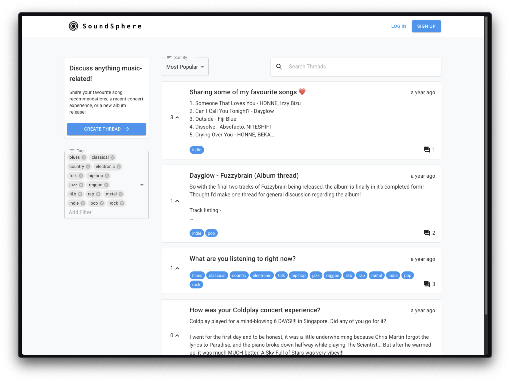

# SoundSphere


SoundSphere is a simple web forum where music aficionados can discuss anything music-related! For
instance, users can discuss a new album release, a concert in the area, or
simply song recommendations.

## 🌟 Key Features

1. Create your profile and become part of the community
2. Create, edit, and delete your own discussion threads and comments
3. Upvote threads that resonate (pun intended!) with you
4. Sort, filter, and search discussion threads

## 🛠️ Technologies Used

### Frontend
- `React`: Provides the structure for building the user interface
- `Redux`: Manages global application state, particularly for user authentication and thread data
- `Material UI`: Provides UI components for a consistent and responsive design

### Backend
- `Go`: Serves as a performant backend language 
- `Go-Chi`: Handles HTTP routing and middleware for building RESTful APIs
- `Gorm`: Simplifies database interactions with an Object-Relational Mapping (ORM) for PostgreSQL
- `Golang-jwt`: Implements account-based authentication using JSON Web Tokens (JWT)

### Database
- `PostgreSQL`: Stores application data

## 🧑🏽‍💻 Usage

### Requirements
- Git 
- Docker Compose

### Setup
1. Clone this repository:
```git clone https://github.com/Zhannyhong/SoundSphere.git```
2. Change directory into the cloned repository:
```cd SoundSphere```
3. Build and run the docker containers: 
```docker compose up -d```

The forum can then be viewed at `http://localhost:3000`. By default, the database will be populated with data from 
`database/database.sql`. The users already in the database can be logged in using the same password as their username.